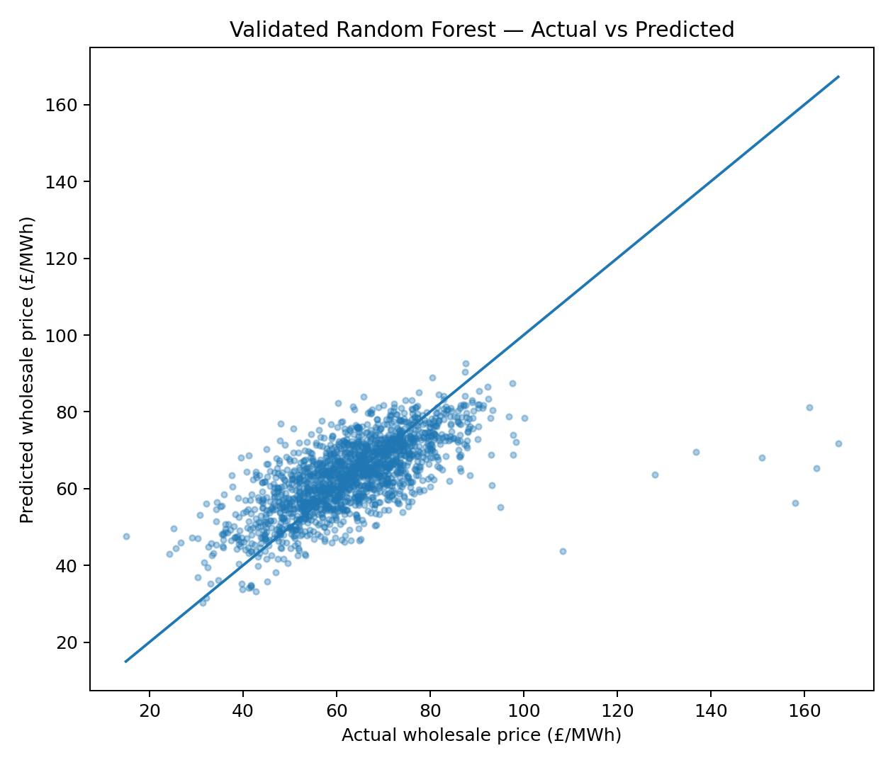
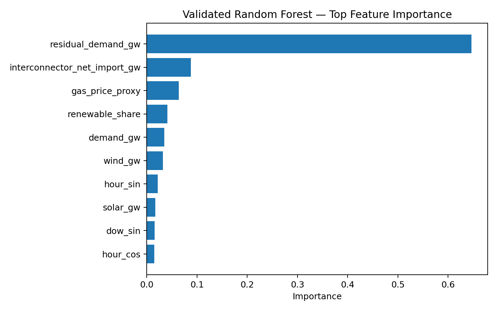
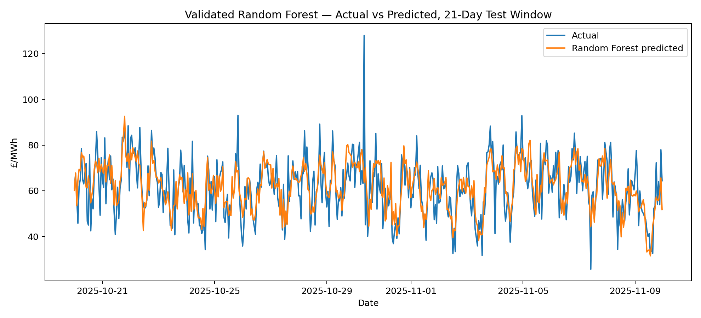

# UK Power Market Analytics

## Business question
How can residual demand, renewable generation, and interconnector conditions be used to reason about wholesale electricity price risk?

## Project status
Portfolio-ready analytical case study built from a reproducible synthetic hourly dataset.

## Dataset
- 8,760 hourly observations
- 2025
- Synthetic/simulated data
- Fixed random seed: 42

## Variables
Demand, wind generation, solar generation, renewable share, residual demand, interconnector net imports, gas-price proxy, system margin, and wholesale electricity price.

## Modelling
- Chronological 80/20 train-test split
- Linear Regression baseline
- Random Forest regression
- Metrics: MAE, RMSE, R²

## Validated results
- Linear Regression: MAE £6.68/MWh; RMSE £9.85/MWh; R² 0.475
- Random Forest: MAE £6.93/MWh; RMSE £10.16/MWh; R² 0.442

## Scenario analysis
- Baseline: £63.43/MWh
- Stress: £76.69/MWh (+20.9%)
- Flexibility: £52.73/MWh (-16.9%)

## Important limitation
These are simulated results and should not be presented as live-market forecasts or real-world predictive accuracy.

## Files
- `UK_Power_Market_Analytics_Case_Study.pdf` — Full analytical case study
- `UK_Power_Market_Analytics_Workbook.xlsx` — Underlying analysis workbook
- `charts/` — Actual vs predicted, feature importance, and 21-day time-series charts

## Charts

